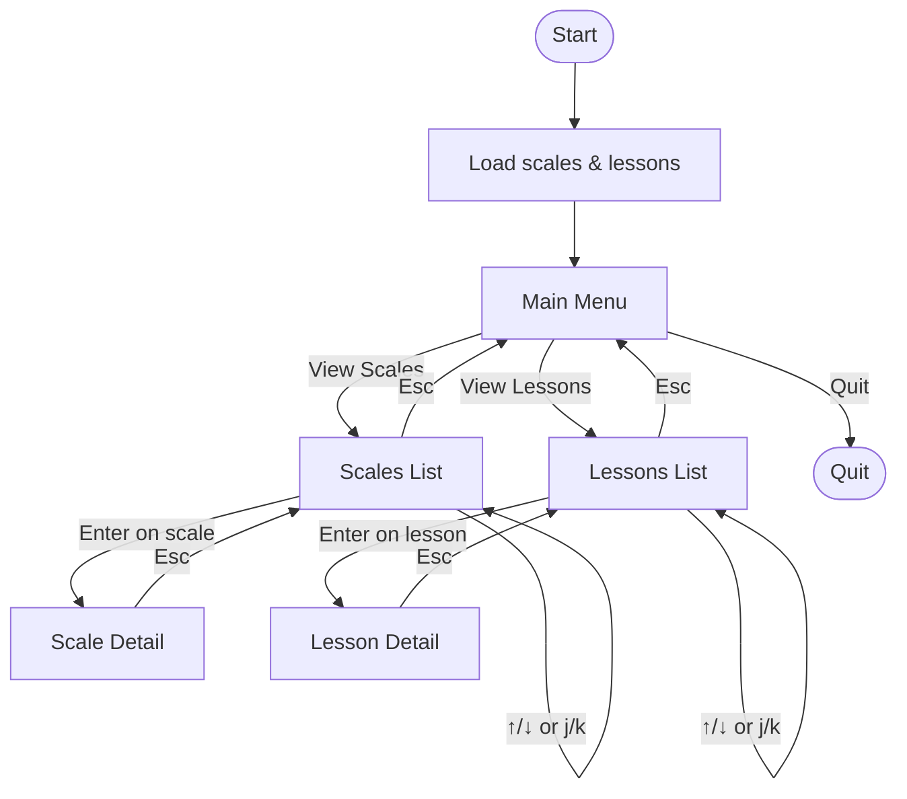
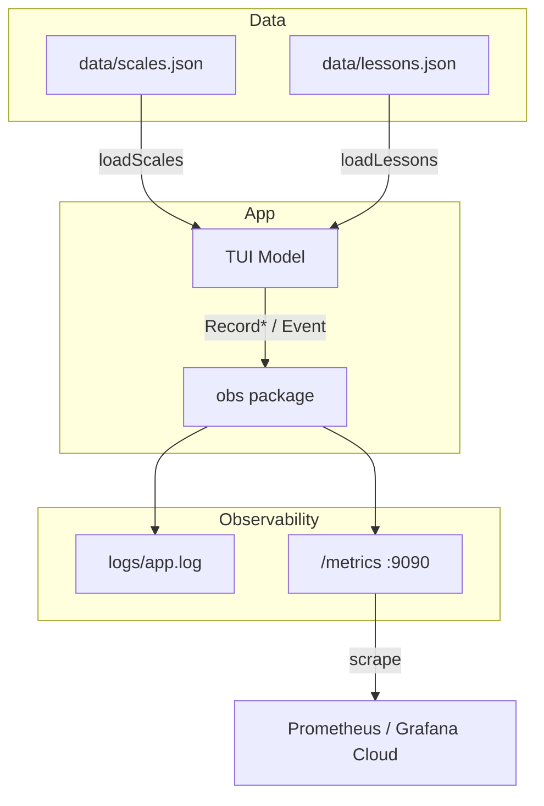

# Application flows

## TUI navigation flow

```mermaid
flowchart TD
    Start([Start]) --> Init[Load scales & lessons]
    Init --> Menu[Main Menu]
    Menu --> |View Scales| ScalesList[Scales List]
    Menu --> |View Lessons| LessonsList[Lessons List]
    Menu --> |Quit| Quit([Quit])
    ScalesList --> |Enter on scale| ScaleDetail[Scale Detail]
    ScalesList --> |Esc| Menu
    ScaleDetail --> |Esc| ScalesList
    LessonsList --> |Enter on lesson| LessonDetail[Lesson Detail]
    LessonsList --> |Esc| Menu
    LessonDetail --> |Esc| LessonsList
    ScalesList --> |↑/↓ or j/k| ScalesList
    LessonsList --> |↑/↓ or j/k| LessonsList
```

## Startup and observability flow

```mermaid
flowchart LR
    Main([main]) --> InitLog[Init logger]
    InitLog --> RecordStart[Record app start]
    RecordStart --> StartMetrics[Start metrics server]
    StartMetrics --> RunTUI[Run TUI]
    RunTUI --> TUI[Menu / Scales / Lessons]
    TUI --> |quit| StopMetrics[Stop metrics server]
    StopMetrics --> RecordExit[Record app exit]
    RecordExit --> LogSummary[Log metrics summary]
    LogSummary --> End([End])
```

## Data and metrics flow

```mermaid
flowchart TD
    subgraph App
        TUI[TUI Model]
        Obs[obs package]
    end
    subgraph Data
        ScalesJSON[data/scales.json]
        LessonsJSON[data/lessons.json]
    end
    subgraph Observability
        Logger[logs/app.log]
        Prometheus["/metrics :9090"]
    end
    ScalesJSON --> |loadScales| TUI
    LessonsJSON --> |loadLessons| TUI
    TUI --> |Record* / Event| Obs
    Obs --> Logger
    Obs --> Prometheus
    Prometheus --> |scrape| PrometheusServer[Prometheus / Grafana Cloud]
```
